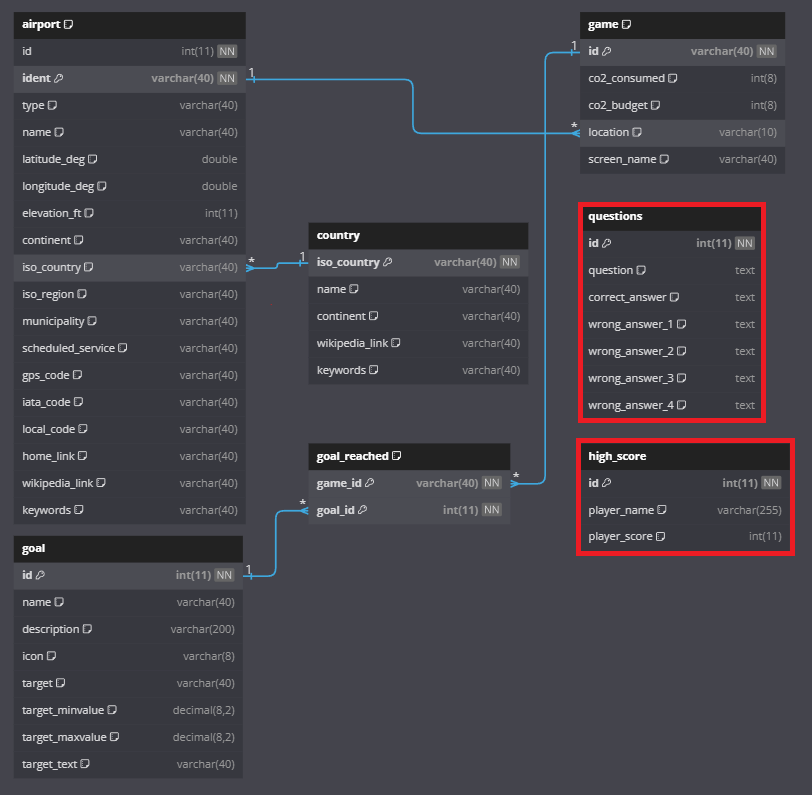

# Software 2 Course Project


This is the repository for the flight game project for the Software 2 course at Metropolia University of Applied Sciences' Information and Communication Technology program, created as the final project for the course. The purpose of the project was to develop the original Software 1 course project by building a frontend for the game.

###    Project Developers:
- [Eemil Nurmi](https://github.com/Scratch4u2)
- [Rene Kilpeläinen](https://github.com/renekilp)
- [Onni Kivinen](https://github.com/onnikiv)
- [Patrik Skogberg](https://github.com/Skogbergp)
  
## Instructions for Running the Game
- Create the database using the ```lentopeli.sql``` file.
-> set the database username to: ```root``` and password to: ```root```
- Required Python libraries: ```mysql.connector```, ```geopy```,```flask```,```flask-cors```
- Run ```main.py``` and open the ```main.html```file -> located in the ```Backend/templates/``` folder.
- Enjoy the game!


## Database
#### (Kuva) Relational model of the database


#### Tables: questions- and high_score added to the original flight_game database.

## Database SQL Code
##### SQL code for the database without data.
```sql
-- --------------------------------------------------------
-- Verkkotietokone:              127.0.0.1
-- Palvelinversio:               11.4.0-MariaDB - mariadb.org binary distribution
-- Server OS:                    Win64
-- HeidiSQL Versio:              12.3.0.6589
-- --------------------------------------------------------

/*!40101 SET @OLD_CHARACTER_SET_CLIENT=@@CHARACTER_SET_CLIENT */;
/*!40101 SET NAMES utf8 */;
/*!50503 SET NAMES utf8mb4 */;
/*!40103 SET @OLD_TIME_ZONE=@@TIME_ZONE */;
/*!40103 SET TIME_ZONE='+00:00' */;
/*!40014 SET @OLD_FOREIGN_KEY_CHECKS=@@FOREIGN_KEY_CHECKS, FOREIGN_KEY_CHECKS=0 */;
/*!40101 SET @OLD_SQL_MODE=@@SQL_MODE, SQL_MODE='NO_AUTO_VALUE_ON_ZERO' */;
/*!40111 SET @OLD_SQL_NOTES=@@SQL_NOTES, SQL_NOTES=0 */;

-- Dumping structure for taulu flight_game.airport
CREATE TABLE IF NOT EXISTS `airport` (
  `id` int(11) NOT NULL,
  `ident` varchar(40) NOT NULL,
  `type` varchar(40) DEFAULT NULL,
  `name` varchar(40) DEFAULT NULL,
  `latitude_deg` double DEFAULT NULL,
  `longitude_deg` double DEFAULT NULL,
  `elevation_ft` int(11) DEFAULT NULL,
  `continent` varchar(40) DEFAULT NULL,
  `iso_country` varchar(40) DEFAULT NULL,
  `iso_region` varchar(40) DEFAULT NULL,
  `municipality` varchar(40) DEFAULT NULL,
  `scheduled_service` varchar(40) DEFAULT NULL,
  `gps_code` varchar(40) DEFAULT NULL,
  `iata_code` varchar(40) DEFAULT NULL,
  `local_code` varchar(40) DEFAULT NULL,
  `home_link` varchar(40) DEFAULT NULL,
  `wikipedia_link` varchar(40) DEFAULT NULL,
  `keywords` varchar(40) DEFAULT NULL,
  PRIMARY KEY (`ident`),
  KEY `iso_country` (`iso_country`),
  CONSTRAINT `airport_ibfk_1` FOREIGN KEY (`iso_country`) REFERENCES `country` (`iso_country`)
) ENGINE=InnoDB DEFAULT CHARSET=latin1 COLLATE=latin1_swedish_ci;

-- Tietojen vientiä ei oltu valittu.

-- Dumping structure for taulu flight_game.country
CREATE TABLE IF NOT EXISTS `country` (
  `iso_country` varchar(40) NOT NULL,
  `name` varchar(40) DEFAULT NULL,
  `continent` varchar(40) DEFAULT NULL,
  `wikipedia_link` varchar(40) DEFAULT NULL,
  `keywords` varchar(40) DEFAULT NULL,
  PRIMARY KEY (`iso_country`)
) ENGINE=InnoDB DEFAULT CHARSET=latin1 COLLATE=latin1_swedish_ci;

-- Tietojen vientiä ei oltu valittu.

-- Dumping structure for taulu flight_game.game
CREATE TABLE IF NOT EXISTS `game` (
  `id` varchar(40) NOT NULL,
  `co2_consumed` int(8) DEFAULT NULL,
  `co2_budget` int(8) DEFAULT NULL,
  `location` varchar(10) DEFAULT NULL,
  `screen_name` varchar(40) DEFAULT NULL,
  PRIMARY KEY (`id`),
  KEY `location` (`location`),
  CONSTRAINT `game_ibfk_1` FOREIGN KEY (`location`) REFERENCES `airport` (`ident`)
) ENGINE=InnoDB DEFAULT CHARSET=latin1 COLLATE=latin1_swedish_ci;

-- Tietojen vientiä ei oltu valittu.

-- Dumping structure for taulu flight_game.goal
CREATE TABLE IF NOT EXISTS `goal` (
  `id` int(11) NOT NULL,
  `name` varchar(40) DEFAULT NULL,
  `description` varchar(200) DEFAULT NULL,
  `icon` varchar(8) DEFAULT NULL,
  `target` varchar(40) DEFAULT NULL,
  `target_minvalue` decimal(8,2) DEFAULT NULL,
  `target_maxvalue` decimal(8,2) DEFAULT NULL,
  `target_text` varchar(40) DEFAULT NULL,
  PRIMARY KEY (`id`)
) ENGINE=InnoDB DEFAULT CHARSET=latin1 COLLATE=latin1_swedish_ci;

-- Tietojen vientiä ei oltu valittu.

-- Dumping structure for taulu flight_game.goal_reached
CREATE TABLE IF NOT EXISTS `goal_reached` (
  `game_id` varchar(40) NOT NULL,
  `goal_id` int(11) NOT NULL,
  PRIMARY KEY (`game_id`,`goal_id`),
  KEY `goalid` (`goal_id`),
  CONSTRAINT `goal_reached_ibfk_1` FOREIGN KEY (`game_id`) REFERENCES `game` (`id`),
  CONSTRAINT `goal_reached_ibfk_2` FOREIGN KEY (`goal_id`) REFERENCES `goal` (`id`)
) ENGINE=InnoDB DEFAULT CHARSET=latin1 COLLATE=latin1_swedish_ci;

-- Tietojen vientiä ei oltu valittu.

-- Dumping structure for taulu flight_game.high_score
CREATE TABLE IF NOT EXISTS `high_score` (
  `id` int(11) NOT NULL AUTO_INCREMENT,
  `player_name` varchar(255) DEFAULT NULL,
  `player_score` int(11) DEFAULT NULL,
  PRIMARY KEY (`id`)
) ENGINE=InnoDB AUTO_INCREMENT=3 DEFAULT CHARSET=utf8mb4 COLLATE=utf8mb4_general_ci;

-- Tietojen vientiä ei oltu valittu.

-- Dumping structure for taulu flight_game.questions
CREATE TABLE IF NOT EXISTS `questions` (
  `id` int(11) NOT NULL AUTO_INCREMENT,
  `question` text DEFAULT NULL,
  `correct_answer` text DEFAULT NULL,
  `wrong_answer_1` text DEFAULT NULL,
  `wrong_answer_2` text DEFAULT NULL,
  `wrong_answer_3` text DEFAULT NULL,
  `wrong_answer_4` text DEFAULT NULL,
  PRIMARY KEY (`id`)
) ENGINE=InnoDB AUTO_INCREMENT=50 DEFAULT CHARSET=utf8mb4 COLLATE=utf8mb4_general_ci;

-- Tietojen vientiä ei oltu valittu.

/*!40103 SET TIME_ZONE=IFNULL(@OLD_TIME_ZONE, 'system') */;
/*!40101 SET SQL_MODE=IFNULL(@OLD_SQL_MODE, '') */;
/*!40014 SET FOREIGN_KEY_CHECKS=IFNULL(@OLD_FOREIGN_KEY_CHECKS, 1) */;
/*!40101 SET CHARACTER_SET_CLIENT=@OLD_CHARACTER_SET_CLIENT */;
/*!40111 SET SQL_NOTES=IFNULL(@OLD_SQL_NOTES, 1) */;
```
